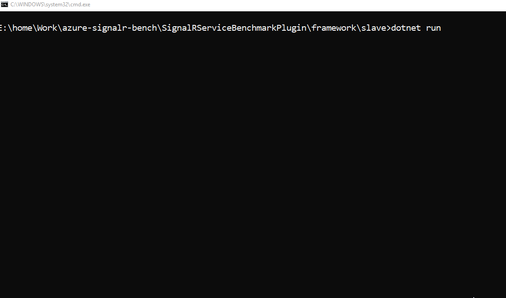

# Benchmark for Microsoft SignalR and Azure SignalR Service

This benchmark defines some typical performance scenarios, develops an Application Server with Azure SignalR SDK, and
builds clients through SignalR client SDK to evaluate the performance of those scenarios.

This benchmark targets to help you evaluate the throughput and latency. It can be used for benchmarking ASP.NET Core SignalR, ASP.NET SignalR and Azure SignalR Service.

# Content

- **scripts**: All scripts related to run the benchmark in a large scale, for example, 50 client VMs and 20 app server VMs. If you plan to setup a large scale performance test on Azure, those scripts are for your reference.

- **src**: The benchmark source code folder which can be run on a single machine with 2 commands. If you want to get a quick start, or check the benchmark source code for further development, please go to this folder.

# Quick start

Run the tool on local machine

## Install

Install the tool

`dotnet tool install --global Microsoft.dotnet-signalr-benchmark --version 1.0.0-preview2.19516.1`

## Run

Start the agent

```
E:\home\Work\SignalRBenchTests>dotnet signalr-bench agent
[11:51:53 INF] Create Rpc Server...
[11:51:53 INF] Start server...
```

Start the application

```
E:\home\Work\SignalRBenchTests>dotnet signalr-bench application
use local signalr: True
Starting serverListening on:
  http://[::]:5050

Press CTRL+C to exit
```

Start the controller with 'echo.yaml'. The content of echo.yaml is

```
mode: simple
config:
  webAppTarget: http://localhost:5050/signalrbench
  connections: 1000
  baseSending: 500
  step: 500
  singleStepDuration: 1000
  debug: true
```

```
E:\home\Work\SignalRBenchTests>dotnet signalr-bench controller -c echo.yaml
[11:45:04 INF] Open channel to rpc server...
[11:45:04 INF] Create Rpc client...
......
[11:54:38 INF] Stop collecting...
[11:54:38 INF] -----------
[11:54:38 INF]   1000 connections established in 9s
[11:54:38 INF] -----------
[11:54:38 INF]  Connections/sendingStep: 1000/500 in 5s
[11:54:38 INF]  Messages: requests: 1.81MB, responses: 1.81MB
[11:54:38 INF]    Requests/sec: 175.80
[11:54:38 INF]    Responses/sec: 175.80
[11:54:38 INF]    Write throughput: 361.44KB
[11:54:38 INF]    Read throughput: 361.44KB
[11:54:38 INF]  Latency:
[11:54:38 INF]   50.00%: < 100 ms
[11:54:38 INF]   90.00%: < 100 ms
[11:54:38 INF]   95.00%: < 100 ms
[11:54:38 INF]   99.00%: < 200 ms
[11:54:38 INF] -----------
[11:54:38 INF]  Connections/sendingStep: 1000/1000 in 4s
[11:54:38 INF]  Messages: requests: 3.67MB, responses: 3.67MB
[11:54:38 INF]    Requests/sec: 446.00
[11:54:38 INF]    Responses/sec: 446.00
[11:54:38 INF]    Write throughput: 916.98KB
[11:54:38 INF]    Read throughput: 916.98KB
[11:54:38 INF]  Latency:
[11:54:38 INF]   50.00%: < 100 ms
[11:54:38 INF]   90.00%: < 100 ms
[11:54:38 INF]   95.00%: < 100 ms
[11:54:38 INF]   99.00%: < 100 ms
[11:54:38 INF] Handle step...
```

## Self-hosted Hub

If you want to setup your own app server for this benchmark with AspNetCore SignalR, please use [built-in app server](https://github.com/Azure/azure-signalr-bench/tree/master/src/appserver) as a reference because the benchmark tool requires the hub to include some predefined methods for all scenarios.

> If you want to try AspNet SignalR, please refer to [AspNet SignalR app server](https://github.com/clovertrail/AspNetServer). The hub class is https://github.com/clovertrail/AspNetServer/blob/master/SignalRBench.cs.

Let us take `echo` as an example.

Create your hub with 2 methods. The `OnConnectedAsync` must include the logic which will inform clients its connection Id.

```
    public class ChatHub : Hub
    {
        public override async Task OnConnectedAsync()
        {
            await Clients.Client(Context.ConnectionId).SendAsync("OnConnected", Context.ConnectionId);
        }

        public void Echo(IDictionary<string, object> data)
        {
            Clients.Client(Context.ConnectionId).SendAsync("RecordLatency", data);
        }
    }
```

Here we use the [built-in app server](https://github.com/Azure/azure-signalr-bench/tree/master/src/appserver) as the benchmark app server. We just need to copy the above ChatHub.cs to [Hub folder](https://github.com/Azure/azure-signalr-bench/tree/master/src/appserver/Hub) modify the hub in

```
        internal const string HUB_NAME = "/signalrbench";
        public void Configure(IApplicationBuilder app)
        {
            if (_useLocalSignalR)
            {
                app.UseSignalR(routes =>
                {
                    routes.MapHub<ChatHub>(HUB_NAME);
                });
            }
            else
            {
                app.UseAzureSignalR(routes =>
                {
                    routes.MapHub<ChatHub>(HUB_NAME);
                });
            }
        }
```

Then you can re-build the appserver and launch it.

See all the predefined methods in the hub. If you want to run perf test on other scenarios, please include other methods.

```
    public class BenchHub : Hub
    {
        public override async Task OnConnectedAsync()
        {
            await Clients.Client(Context.ConnectionId).SendAsync("OnConnected", Context.ConnectionId);
        }

        public void Echo(IDictionary<string, object> data)
        {
            Clients.Client(Context.ConnectionId).SendAsync("RecordLatency", data);
        }

        public void Broadcast(IDictionary<string, object> data)
        {
            Clients.All.SendAsync("RecordLatency", data);
        }

        public void SendToClient(IDictionary<string, object> data)
        {
            var targetId = (string)data["information.ConnectionId"];
            Clients.Client(targetId).SendAsync("RecordLatency", data);
        }

        public void ConnectionId()
        {
            Clients.Client(Context.ConnectionId).SendAsync("ConnectionId", Context.ConnectionId);
        }

        public string GetConnectionId()
        {
            return Context.ConnectionId;
        }

        public async Task JoinGroup(string groupName)
        {
            await Groups.AddToGroupAsync(Context.ConnectionId, groupName);
            await Clients.Client(Context.ConnectionId).SendAsync("JoinGroup");
        }

        public async Task LeaveGroup(string groupName)
        {
            await Groups.RemoveFromGroupAsync(Context.ConnectionId, groupName);
            await Clients.Client(Context.ConnectionId).SendAsync("LeaveGroup");
        }

        public void SendToGroup(IDictionary<string, object> data)
        {
            var groupName = (string)data["information.GroupName"];
            Clients.Group(groupName).SendAsync("RecordLatency", data);
        }
    }
```

# Run the self build benchmark

You can build and run the source code by yourself.


Take 1000 connections for `Echo` performance test as an example.

## Build
Build the tool through [build.bat](https://github.com/Azure/azure-signalr-bench/blob/master/build.bat) or [build.sh](https://github.com/Azure/azure-signalr-bench/blob/master/build.sh) script.

## Run
Go to [agent folder](https://github.com/Azure/azure-signalr-bench/tree/master/src/agent)
```
dotnet run
```

Go to [master folder](https://github.com/Azure/azure-signalr-bench/tree/master/src/master)

```
dotnet run -- --BenchmarkConfiguration echo.yaml
```
Configuration file "echo.yaml" is very simple. There are two required values: `mode` and `webAppTarget`. `mode` is always `simple`. `webAppTarget` is the SignalR Hub URL. Default scenario is "echo" even though you did not specify it.

```yaml
mode: simple
config:
  webAppTarget: http://localhost:5050/signalrbench
```

If you have a Azure SignalR Service connection string, but does not want to setup the app server, you can specify connection string instead. The benchmark will launch an internal app server for you. It is recommended for serious performance test.

Use internal app server, please specify `connectionString` instead.
```yaml
mode: simple
config:
  connectionString: Endpoint=https://xxx;AccessKey=xxx
```

The output is like:
```
-----------
  1000 connections established in 8s
-----------
 Connections/sendingStep: 1000/500 in 246s
 Messages: requests: 244.88MB, responses: 244.88MB
   Requests/sec: 484.17
   Responses/sec: 484.17
   Write throughput: 995.46KB
   Read throughput: 995.46KB
 Latency:
  50%: < 100 ms
  90%: < 100 ms
  95%: < 100 ms
  99%: < 100 ms
-----------
 Connections/sendingStep: 1000/1000 in 245s
 Messages: requests: 489.71MB, responses: 489.71MB
   Requests/sec: 972.18
   Responses/sec: 972.18
   Write throughput: 2.00MB
   Read throughput: 2.00MB
 Latency:
  50%: < 100 ms
  90%: < 100 ms
  95%: < 100 ms
  99%: < 100 ms
```

## More options

You can see more options by running the following command in [master folder](https://github.com/Azure/azure-signalr-bench/tree/master/src/master)

```
dotnet run -- --BenchmarkConfiguration ?
```

The benchmark supports many scenarios including echo, broadcast, send to connections, and send to groups. Those scenarios apply on both SignalR and Azure SignalR Service. In addition, it supports Azure SignalR specific scenarios, for example, scenarios on serverless mode: send to user, send to group, and broadcast through REST API.

## Typical scenarios

The following configuration examples are for both SignalR and Azure SignalR Service. Before running those test, please start the app server and replace the `webAppTarget` with your Hub URL.

- broadcast: broadcast a message to 100 clients every second
```yaml
mode: simple
config:
  webAppTarget: http://localhost:5050/signalrbench
  connections: 100
  baseSending: 1
  step: 1
  sendingSteps: 1
scenario:
  name: broadcast
```
- send to connections: send messages to 1000 clients
```yaml
mode: simple
config:
  webAppTarget: http://localhost:5050/signalrbench
scenario:
  name: sendToClient
```
- send to groups: create 500 groups for 1000 connections, which means every group has 2 connections. The benchmark sends message to every group.
```yaml
mode: simple
config:
  webAppTarget: http://localhost:5050/signalrbench
  connections: 1000
  baseSending: 500
scenario:
  name: sendToGroup
  parameters:
    groupCount: 500
```
- echo through streaming: there are 1000 client connections who send streaming message to hub which will echo message back to client through streaming API.
```yaml
mode: simple
config:
  webAppTarget: http://localhost:5050/signalrbench
  connections: 1000
  step: 500
scenario:
  name: streamingEcho
  parameters:
    messageSize: 1048
    streamingItemCount: 2
    streamingItemSendDelay: 0
```

## Azure SignalR Service specific scenarios.

Please replace the `connectionString` with your own one.

- restBroadcast
```yaml
mode: simple
config:
  connectionString: Endpoint=https://xxx;AccessKey=xxx
  connections: 100
  baseSending: 1
  step: 1
  sendingSteps: 1
scenario:
  name: restBroadcast
```
- restSendToUser
```yaml
mode: simple
config:
  connectionString: Endpoint=https://xxx;AccessKey=xxx
scenario:
  name: restSendToUser
```
- restSendToGroup
```yaml
mode: simple
config:
  connectionString: Endpoint=https://xxx;AccessKey=xxx
  connections: 1000
  baseSending: 500
scenario:
  name: restSendToGroup
  parameters:
    groupCount: 500
```

## Default settings

Default connection transport type is `Websockets`, protocol is `json`, message size is 2048. Feel free to change those if you want to test more configurations.

# Contributing

This project welcomes contributions and suggestions.  Most contributions require you to agree to a
Contributor License Agreement (CLA) declaring that you have the right to, and actually do, grant us
the rights to use your contribution. For details, visit https://cla.microsoft.com.

When you submit a pull request, a CLA-bot will automatically determine whether you need to provide
a CLA and decorate the PR appropriately (e.g., label, comment). Simply follow the instructions
provided by the bot. You will only need to do this once across all repos using our CLA.

This project has adopted the [Microsoft Open Source Code of Conduct](https://opensource.microsoft.com/codeofconduct/).
For more information see the [Code of Conduct FAQ](https://opensource.microsoft.com/codeofconduct/faq/) or
contact [opencode@microsoft.com](mailto:opencode@microsoft.com) with any additional questions or comments.
