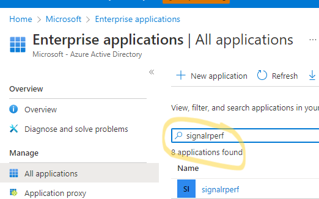

# Setup

## Dependency
1. [WSL](https://docs.microsoft.com/en-us/windows/wsl/install) or Linux 
2. [az cli](https://docs.microsoft.com/en-us/cli/azure/install-azure-cli-linux?pivots=apt) [Version >=2.37]
3. [.NET 5 sdk](https://dotnet.microsoft.com/en-us/download/dotnet/5.0)
4. A tenant you are allowed to [register AAD applications](https://docs.microsoft.com/en-us/azure/active-directory/develop/howto-create-service-principal-portal#permissions-required-for-registering-an-app) 
5. [jq](https://stedolan.github.io/jq/) , [nodejs](https://nodejs.org/en/) , [npm](https://www.npmjs.com/package/npm), [helm](https://helm.sh/docs/intro/install/#from-pkg-freebsd)

>To avoid dealing with those dependencies (except 4), you could use **Azure Cloud Shell** to run all the scripts. The dependencies have been installed in the Azure Cloud Shell env already.

In the Azure Cloud shell: Bash (**Recommended** :grinning:)
```bash
git clone --single-branch --branch v2 https://github.com/Azure/azure-signalr-bench.git
```


## Steps
SignalR performance tool uses AKS to run the tests. To setup the initial environment, you could run below script. :smiley: Make the [prefix] unique. [location] is the region you put your resouces in like eastus.

> :warning: **Below init script will create resources and generate cost !**
```bash
cd Initialize && chmod +x ./*.sh
./init.sh -p [prefix] -l [location]  ## This will take about 20 minutes
```
Grant permission to users/groups

1. [Assign the Contributor role to allowed users](https://docs.microsoft.com/en-us/azure/active-directory/develop/howto-add-app-roles-in-azure-ad-apps#assign-users-and-groups-to-roles)
   First find your service principle in your AAD Enterprise applications. Use your [prefix] to search the service principle
  
   
   
    Select the service principle and add user/group. This will determine who can access the test tool portal. 
    
    You can come back and add more people later. Add yourself now.
   
   
2. <s>  Modify the Azure AAD config (clientID and TenantID) in src/Pods/Portal/appsettings.json accordingly(Use the clientID and tenantID of the Application you just created). </s>


After that, you need to init the deployments inside the aks

```bash
./publish.sh -p [prefix] -a #This will take about 20 minutes
```

**Now everything is ready, you could go to the printed url to create performance tests! :blush:**

### FAQs
1. Failed trying to add nodePool or setup aks 
> VM quota issues: You need to change the VM size according to the quota in your subscription or [request VM quota](https://docs.microsoft.com/en-us/azure/azure-portal/supportability/per-vm-quota-requests)

> Outbound IP port issue: You need to [add more ips](https://docs.microsoft.com/en-us/azure/aks/load-balancer-standard#scale-the-number-of-managed-outbound-public-ips) to your load balancer if you trying to add a large node pool 

2. SSL cert not safe
> NSG issue: If the NSG in the created AKS resource group blocks outbound traffic, the SSL certificate verification would fail. 

3. What's the portal domain? Run below command to get the urls
>  ./publish -p [prefix] 


# Contributing

This project welcomes contributions and suggestions.  Most contributions require you to agree to a
Contributor License Agreement (CLA) declaring that you have the right to, and actually do, grant us
the rights to use your contribution. For details, visit https://cla.microsoft.com.

When you submit a pull request, a CLA-bot will automatically determine whether you need to provide
a CLA and decorate the PR appropriately (e.g., label, comment). Simply follow the instructions
provided by the bot. You will only need to do this once across all repos using our CLA.

This project has adopted the [Microsoft Open Source Code of Conduct](https://opensource.microsoft.com/codeofconduct/).
For more information see the [Code of Conduct FAQ](https://opensource.microsoft.com/codeofconduct/faq/) or
contact [opencode@microsoft.com](mailto:opencode@microsoft.com) with any additional questions or comments.
